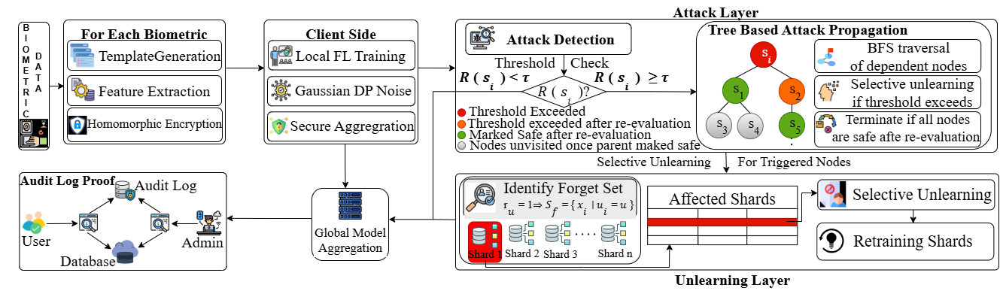

# FDPTU: Federated Differential Privacy with Unlearning

FDPTU is a federated learning framework designed for **privacy-preserving and attack-aware machine learning**. It integrates:

* Differential Privacy (DP-SGD via Opacus)
* Sharded Federated Unlearning (SFU)
* Membership Inference Attack (MIA) evaluation
* Multimodal biometric learning (iris + fingerprint, face for attack evaluation)

---

## 📢 Publication

This work has been accepted at:

**IEEE World Congress on Computational Intelligence (WCCI 2026)**
**International Joint Conference on Neural Networks (IJCNN 2026 Track)**

---

## 🧠 System Overview

Below is the high-level architecture of the FDPTU framework:



> *The framework integrates federated learning, differential privacy, sharded unlearning, and attack-aware evaluation into a unified pipeline.*

---

## 📂 Repository Structure

```
FDPTU/
│
├── datasets/              # Dataset loaders
├── models/                # Model architectures
├── federated/             # FL server & client logic
├── privacy/               # DP training (Opacus)
├── unlearning/            # Sharded unlearning (SFU)
├── attacks/               # MIA evaluation
├── experiments/           # Training scripts
│
├── script.py               # Plot & utility scripts
│
├── results/               # Stored experiment outputs
│   ├── fedavg_face.json
│   ├── dpfedavg_face.json
│   ├── FDPTU_metrics.json
│   ├── mia_results.json
│
├── plots/                 # Final figures used in paper
│   ├── heatmap.png
│   ├── mia_bar.png
│   ├── architecture.png
│
├── README.md
├── requirements.txt
└── .gitignore
```

---

## 📊 Dataset Structure

The project uses a multimodal biometric dataset. The expected structure is:

```
datasets/
│
└── iris_fingerprint/
    ├── client_1/
    │   ├── iris/
    │   │   ├── img1.png
    │   │   └── ...
    │   └── fingerprint/
    │       ├── img1.png
    │       └── ...
    │
    ├── client_2/
    │   └── ...
    │
    └── ...
```

For face-based attack evaluation:

```
datasets/
└── face/
    ├── train/
    ├── test/
```

> ⚠️ Datasets are not included in this repository due to size and licensing constraints.

---

## 🚀 How to Run

### 1️⃣ Train FedAvg

```
python -m FDPTU.experiments.run_fedavg_face
```

### 2️⃣ Train DP-FedAvg

```
python -m FDPTU.experiments.run_dp_fedavg_face
```

### 3️⃣ Run FDPTU (Training + Unlearning)

```
python -m FDPTU.experiments.run_FDPTU
```

### 4️⃣ Run MIA Evaluation

```
python -m FDPTU.attacks.run_mia
```

### 5️⃣ Generate All Plots

```
python scripts.py
```

---

## 📈 Outputs

* Results are stored in:
  `FDPTU/results/`

* Generated plots are saved in:
  `FDPTU/plots/`

---

## 🔐 Key Features

* Attack-aware unlearning via residual influence removal
* Reduced MIA leakage after unlearning
* Efficient shard-based retraining (~55% lower cost than full retraining)
* Stable multimodal representation learning

---

## 📌 Notes

* Model checkpoints are not included
* Results can be reproduced using provided scripts
* Plots in the paper are either generated via scripts, matlab or stored in `plots/`